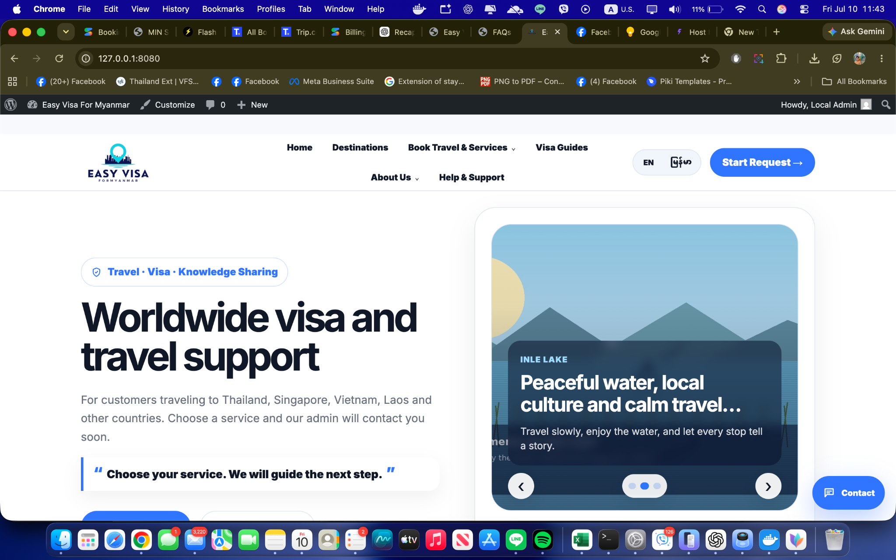

# Easy Visa For Myanmar WordPress Theme

A clean, mobile-friendly WordPress theme for worldwide visa and travel support services. Main service coverage includes Thailand, Singapore, Vietnam, Laos, Malaysia, and other countries.

**Current version:** `v59 / 1.5.9`  
**WordPress:** 6.0+  
**PHP:** 7.4+  
**Theme folder:** `easy-visa-myanmar/`

## Developer Info

- **Developer:** Min SiThu
- **Website:** https://minsithu.org
- **GitHub:** https://github.com/itsmeminsithu/

## Theme Preview

The package now includes the latest real homepage screenshot as the official WordPress theme preview and repository preview image.




## GitHub-ready package

This repository package is ready to upload to GitHub. The editable WordPress theme source is in `easy-visa-myanmar/`. The installable WordPress ZIP is in `releases/`.

For upload steps, see `UPLOAD_TO_GITHUB.md`.

## Main features

- Modern homepage with hero, random quote, and clear call-to-action.
- **Book Travel & Services** request section with 6 service tabs.
- Mobile service dropdown for easier phone use.
- Full service pages for Letter Service and TM30 Service.
- Visa Guides / Blog system with categories, archive, single guide pages, search, updated-date labels, and Start Request CTAs.
- Inquiries saved in WordPress Admin.
- Inquiry workflow statuses and private admin notes.
- FAQ CMS with service groups.
- Destinations CMS.
- Customer Reviews CMS, shown publicly only when real live reviews exist.
- Hero Slides CMS.
- Popup Messages CMS.
- Basic SEO meta support, schema output, sitemap reference, and search engine verification fields.
- Security layer for spam, scam, bot, login, and hardening protections.

## Services

### Flight Ticket
Request fields include name, contact info, preferred contact method, from, to, departure, return, passengers, and privacy consent.

### Hotel Rent
Request fields include name, contact info, preferred contact method, destination, check-in, check-out, guests, rooms, and privacy consent.

### Easy Pass Services
Supports airport choices `DMK`, `BKK`, and `CNX`, plus visa type options such as TR Visa, ED Visa, DTV Visa, Visa on Arrival, Business Visa, Non-B, Non-O, Non-Immigrant, Transit, and Other Visa.

### Easy Extension
Supports Arrival Visa and TR Visa, with extension methods `e Extension` and `Walk In VIP Extension`.

### Letter Service
Myanmar nationality only. Letter options:

- Visa Extension (ဗီဇာသက်တမ်းတိုး)
- Bank Recommendation Letter (ဘဏ်ဖွင့်ဖို့ ထောက်ခံစာ)
- Driving License Recommendation Letter (ယာဉ်မောင်းလိုင်စင်ပြုလုပ်ဖို့ - တိုးဖို့ ထောက်ခံစာ)
- Motorcycle / Car Buying Letter (ယာဉ်ဝယ်ဖို့ ထောက်ခံစာ)

### TM30 Service
No passport upload on the website. TM30 fields include name, country, contact info, region, delivery method, notes, and privacy consent.

Supported regions:

- Bangkok
- Chiang Mai
- Mae Sot

Delivery methods:

- LINE
- Facebook
- Email
- Message
- Telegram
- WhatsApp

## Installation

1. Download the latest ZIP: `easy-visa-myanmar-wordpress-theme-v59.zip`.
2. In WordPress Admin, go to **Appearance -> Themes -> Add New -> Upload Theme**.
3. Upload the ZIP and activate the theme.
4. Go to **Appearance -> Easy Visa Setup -> Create / Refresh Starter Pages**.
5. Go to **Settings -> Permalinks -> Save Changes**.
6. Configure **Appearance -> Customize -> Easy Visa Home Settings**.
7. Create and assign the Primary Menu.
8. Add real FAQs, reviews, guide posts, destinations, and photos.

## Recommended production setup

- HTTPS only.
- Cloudflare or hosting WAF/DDoS protection.
- SMTP plugin or server SMTP setup.
- Strong admin password and two-factor authentication.
- Regular backups outside the server.
- Keep WordPress, plugins, and theme updated.
- SEO plugin optional: Yoast SEO, Rank Math, AIOSEO, or SEOPress.
- Translation plugin optional: Polylang or TranslatePress.

## Security notes

The theme includes nonce checks, honeypots, timed form tokens, rate limits, suspicious content checks, link limits, temporary blocking, login throttling, XML-RPC disable, REST user listing restriction, author enumeration blocking, comments/pingbacks disable, generator removal, pingback header removal, and security headers.

A WordPress theme cannot fully stop real network-level DDoS by itself. Use Cloudflare or hosting-provider DDoS protection.

## GitHub upload example

```bash
git init
git add .
git commit -m "Initial Easy Visa For Myanmar v59 theme"
git branch -M main
git remote add origin https://github.com/itsmeminsithu/easy-visa-myanmar-wordpress-theme.git
git push -u origin main
```

## Recommended repository structure

```text
easy-visa-myanmar-wordpress-theme/
├── easy-visa-myanmar/              # WordPress theme folder
├── docs/
│   ├── PROJECT_RECAP.md
│   ├── SECURITY.md
│   └── MINDDRAW_EXPLAIN.md
├── README.md
├── CHANGELOG.md
└── .gitignore
```

## Changelog summary

### v50 / 1.5.0
Added Letter Service and TM30 Service booking tabs, pages, FAQ groups, and validation options.

### v51 / 1.5.1
Removed TM30 passport upload and restored safe basic-request-only flow.

### v52 / 1.5.2
Added full landing pages for Letter Service and TM30 Service.

### v53 / 1.5.3
Renamed homepage section to Book Travel & Services and added Visa Guides / Blog system.

### v54 / 1.5.4
Added stronger form validation, inquiry status workflow, admin notes, safer starter-page setup, and service-specific Thank You messages.

### v55 / 1.5.5
Removed the “Not sure?” detail blocks from homepage forms.

### v56 / 1.5.6
Cleaned trust and UX: removed fake reviews, improved mobile service selection, form errors, inquiry filters, copy buttons, guide search, and updated-date labels.

### v57 / 1.5.7
Added stronger security layer for spam/scam protection, login hardening, WordPress hardening, security headers, and SECURITY.md.

### v58 / 1.5.8
Added developer metadata across the theme, docs, and handoff files.

### v59 / 1.5.9
Added the supplied homepage screenshot as the official WordPress theme preview (`screenshot.png`), refreshed the PDF/project/GitHub/mindmap handoff files, and synchronized all delivery packages.

## License

GPLv2 or later.
