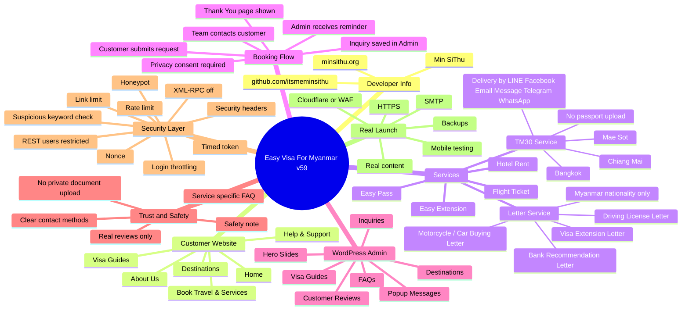

# Easy Visa v59 Minddraw Explain File

This file explains the project as a mind map. You can copy the Mermaid block into a Markdown viewer that supports Mermaid, or use the `.drawio` file in diagrams.net.

## How to read the mind map

- **Customer Website** shows the main public navigation.
- **Services** shows the six request types and the two newest services.
- **Booking Flow** shows what happens after a customer submits a form.
- **WordPress Admin** shows the internal CMS tools used by the business.
- **Trust and Safety** shows customer confidence and privacy choices.
- **Security Layer** shows what the v57-v59 security layer added to reduce spam, scams, bot abuse, and login abuse.
- **Theme Preview** points to the included homepage screenshot used in the theme and repo.
- **Real Launch** shows what still needs to be done on hosting before public release.

## Developer Info

- **Developer:** Min SiThu
- **Website:** https://minsithu.org
- **GitHub:** https://github.com/itsmeminsithu/
